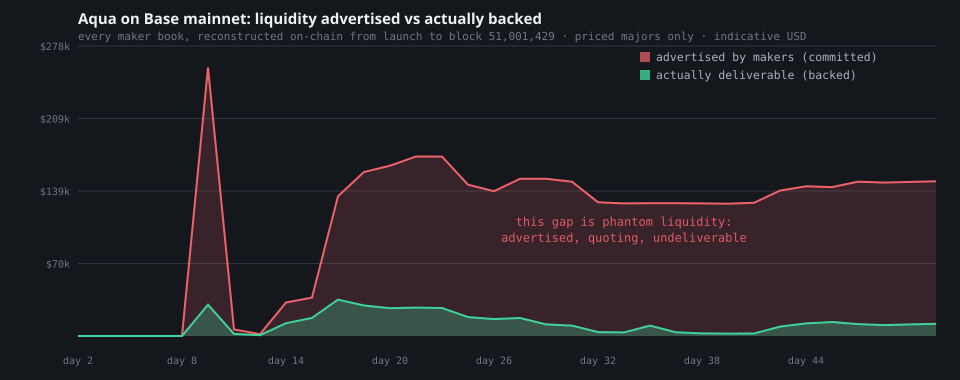
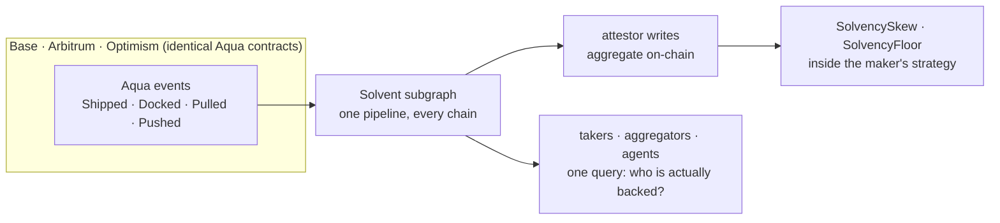

<p align="center">
  
</p>

In options, selling what you do not hold is called writing naked. On
[1inch Aqua](https://github.com/1inch/aqua), every quote can be naked, and neither the
maker's own strategies nor the takers filling them have any way to know.

Solvent makes Aqua positions aware of their own balance sheet: quotes that widen as the
maker's book thins, a hard floor below which they decline instead of failing, and a
cross-chain index of every maker's true backing.

---

## The problem

Aqua is a shared liquidity layer. A market maker commits inventory to a strategy
**without depositing it**. Tokens stay in the maker's wallet, and Aqua pulls them only at
the moment a taker fills. No custody, no vault, no idle capital.

The headline benefit is that **one balance can back many strategies at once**. 1inch's
own worked example: a $100,000 balance supporting three positions that collectively quote
$300,000. Genuine capital efficiency, and the maker's losses stay capped, since nothing
is borrowed and the protocol can never take on bad debt.

But it has a structural consequence:

> **Every Aqua maker is running a fractional-reserve book, and no strategy knows about
> the others.**

SwapVM, the bytecode VM that executes Aqua strategies, has no concept of the maker's
aggregate position. Each strategy quotes as if it alone owned the whole wallet. Aqua's
`ship()` performs no aggregate check: no sum across strategies, no comparison against
balance or allowance. And the whitepaper is explicit about what happens as commitments
drift away from backing (emphasis ours):

> *"When a Maker's actual wallet balance falls below their virtual balance commitments,
> strategies become illiquid: trades cannot execute because pull operations will revert.
> Importantly, **the AMM continues quoting prices based solely on virtual balances without
> checking real balances or allowances**."*

> *"**While Aqua doesn't automatically pause illiquid positions, Makers are strongly
> recommended to manually dock strategies** that become chronically underfunded to prevent
> accumulating unfavorable price exposure."*

The venue keeps quoting. The protocol will not pause. The prescribed remedy is a human,
watching, by hand.

## The pain, measured on mainnet

We reconstructed **every maker's balance sheet in Aqua's entire history on Base**, at
event resolution, from primary data: each strategy's tokens and amounts decoded from its
`ship()` transaction, every `Pulled` and `Pushed` applied as a delta, `Docked` books
zeroed, and each maker's actual backing (wallet balance and allowance to Aqua) read from
an archive node at 34 heights plus every book's peak moment. 442 of 443 strategies
covered. Scripts and raw output are in this repo
([`scripts/analyze-history.ts`](scripts/analyze-history.ts),
[`docs/mainnet-history.json`](docs/mainnet-history.json)).



Six weeks of live protocol, blocks 48,839,900 to 51,001,429: 443 strategies shipped by
**115 distinct makers**, with 3,848 pulls and 2,894 pushes settled through
their wallets. And against that activity:

| Finding | Value |
| --- | --- |
| Maker books that ever held a material commitment (over $100) | 88 |
| Books observed **under-backed** at least once | **78 of 88** |
| Distinct makers observed under-backed at material size | **45** |
| Material observations that were under-backed | **89%** (560 of 630) |

The worst offenders are not dust:

| Maker | Book | Peak advertised | Worst backing | Persistence |
| --- | --- | --- | --- | --- |
| [`0x5500e69d…237f`](https://basescan.org/address/0x5500e69d58d8f80b236c8a72fd52c538a5d5237f) | WETH | ~$162,754 | **9.8%** | multiple snapshots |
| [`0x7553afc9…4a55`](https://basescan.org/address/0x7553afc9cf3815ce24e33d14d1431b2918484a55) | USDC | ~$51,161 | **0.0%** | **weeks**, across 25 snapshots ~1.5 days apart |

That second book advertised roughly $50,000 of USDC while holding effectively nothing,
continuously, for weeks. Every taker who tried it got a revert. Every aggregator that
routed to it wasted its users' gas.

The same pipeline, pointed unchanged at the identical Aqua contracts on the other chains,
finds the same disease everywhere:

| Chain | Makers | Material books | Under-backed books | Worst observed |
| --- | ---: | ---: | ---: | --- |
| Base | 115 | 89 | **79** | WETH book of ~$162,754 at 9.8% backing |
| Arbitrum | 47 | 47 | **42** | WETH book of ~$142,576 at 50% backing |
| Optimism | 8 | 2 | **2** | WBTC book of ~$753 at 39% backing |
| **Total** | **170** | **138** | **123** | |

Method notes, for the skeptical: USD figures use a fixed indicative price table for major
tokens and exist only to rank materiality; backing is `min(balance, allowance)`, because
a revoked allowance makes a quote exactly as unfillable as an empty wallet; and the
mechanics are independently reproducible against the real contracts in
[`contracts/test/FractionalReserve.t.sol`](contracts/test/FractionalReserve.t.sol),
where one wallet holding 10 WETH ships three strategies advertising 30, every strategy
individually passes a backing check, and the second taker reverts through no fault of
their own.

## Who gets hurt

**Makers.** An illiquid strategy keeps quoting through price moves it cannot trade
against. The whitepaper compares the result to impermanent loss: when liquidity returns,
*"the first executable trade locks in those adverse price movements."* The recommended
defence, manual monitoring of a book that was designed to be passive, does not scale.

**Takers, especially automated ones.** An unbacked quote is indistinguishable from a
backed one until you spend gas trying to fill it. A human might notice a sketchy maker.
An agent routing purely on price will hit the same phantom quote again and again.

**Aggregators and solvers.** Unbacked quotes are often the best-priced quotes, because
stale positions quote straight through market moves. They win the route, then revert.
Fill rate is the metric aggregators live and die by.

**The venue.** None of this is bad debt, but all of it is reputation. A venue whose
quotes cannot be trusted pays for it in routing priority.

---

## What Solvent does

Solvent makes an Aqua position aware of its own balance sheet, in bytecode. Three parts:

### 1 · `SolvencySkew`: quotes that widen as the book thins

A custom SwapVM instruction. The maker's utilisation, total commitments across every
strategy divided by what the wallet actually holds and has approved, feeds directly into
pricing:

```
utilisation 40%   →  quote at fair price
utilisation 80%   →  spread widens          (scarce inventory costs more)
utilisation 95%   →  spread widens sharply  (you are nearly a phantom)
```

This is the economically correct behaviour: the last unit of a shared balance sheet is
worth more than the first. Professional market makers have skewed quotes against
inventory since long before Avellaneda and Stoikov formalised it in 2008. It is table
stakes everywhere except on-chain, where strategies have been blind to their own books.

### 2 · `SolvencyFloor`: refuse before you fail

A hard floor. Below a maker-chosen reserve ratio, the strategy **declines at quote
time**, cheaply and visibly, instead of failing at settlement after a taker has committed
gas. This is the automatic pause the whitepaper leaves manual. And because it lives in
the program bytes, **any taker can verify the covenant before trading**. A maker who
ships a floor makes a checkable promise: my quotes are covered, and I stop quoting before
that stops being true.

### 3 · The balance-sheet index: the number nothing on-chain can compute

Both instructions need one number: the maker's aggregate commitment. **Aqua cannot
produce it.** Balances are stored per `(maker, app, strategyHash, token)` with no
enumeration, no per-maker total, and no event carrying the aggregate. The only way to
know a maker's book is to replay every `Shipped`, `Docked`, `Pulled` and `Pushed` since
genesis, which is exactly what the analysis above did, and exactly what an index is for.

One subgraph pipeline, deployed unchanged against the identical Aqua contracts on
**Base, Arbitrum and Optimism**, maintains every maker's live balance sheet. An attestor
publishes each maker's aggregate on-chain where the opcodes read it, and anyone can
recompute the same number from the same public index.



## What each side gets

**Makers** get the risk management the whitepaper tells them to do by hand, automated
and inside their own strategy: no adverse exposure quietly accumulating, no 3am docking,
and the capital efficiency of shared balances kept rather than abandoned.

**Takers and agents** get a pre-trade answer to the only question that matters: will
this quote actually fill? The covenant is readable in the program bytes; the balance
sheet is queryable in the index. No more gas spent discovering a phantom.

**Aggregators and solvers** get fill rate: rank quotes by reserve ratio with one query,
stop routing to the 45 makers above, and stop losing user
transactions to reverts.

**Aqua** gets what the load line gave shipping: a venue where a covered quote is worth
more than a naked one, enforced by adoption instead of protocol change.

---

## Watch a position defend itself

One wallet, 10 WETH, three strategies quoting side by side. Every number below is from
a live run on Base Sepolia (`pnpm vignette`), flowing through the full production loop:
chain, The Graph, attestor, SolventBook, quote.

```
wallet 10.00 WETH · committed 4.50 WETH · utilisation 45%

  strategy A      bid 3,106.67
  strategy B      bid 3,106.67
  strategy C      bid 3,106.67

a taker fills A for 500 USDC - fills are healthy business

  strategy A      bid 3,809.89      ← repriced its own inventory
  strategy B      bid 3,106.67      ← untouched, and correctly so
  strategy C      bid 3,106.67

the maker redeploys half the wallet to another venue · utilisation 87%

  strategy B      bid 3,202.86      ← spread widened itself, no keeper, no dock
  strategy C      bid 3,201.23      ← repriced for a thinner book

the maker keeps going, past the floor · utilisation 99%

  strategy A      declined: SolvencyFloor          ← refused at quote time
  strategy B      declined: SolvencyFloor
  strategy C      declined: SolvencyFloor          ← nothing for a taker to waste gas on
```

The fill only moved the book that was filled. What moved B and C was the wallet
draining underneath them, which emits no Aqua event at all: the index catches it, the
attestor writes it on-chain, and the quotes react. Before Solvent these books would
quote the stale price until settlement reverted in a taker's face. Here they priced
the risk, then refused it.

## Landscape

The closest relative is **exchange proof-of-reserves**, and the comparison is
instructive. Same intuition, verify the backing instead of trusting the advertisement,
but PoR only exists where a custodian holds the assets, and it is attested quarterly by
auditors. Solvent is proof-of-reserves for makers who never deposit, recomputed
continuously from public events, checkable by anyone.

Everything else in the neighbourhood watches a different layer. Risk platforms like
Gauntlet and Chaos Labs tune protocol parameters and monitor custodial reserves. Aqua's
own emerging tooling builds order books and manages strategies. None of them can see a
maker's aggregate book, because the protocol never computes it and no single contract
read reveals it. And 1inch's documented remedy for the problem is a human docking
strategies by hand.

Nobody prices an on-chain maker's solvency because, before Aqua, the question could not
exist: every other venue takes custody, so backing is 1.0 by construction. Aqua created
the category by deleting custody. Solvent is the first entrant, and the 123 under-backed
books above are the reason it needs to.

## Why now

1. **The venue is weeks old** and already multichain at identical addresses, with
   115 real makers, 45 of them already caught quoting
   more than they held. The fix should exist before the population scales.
2. **The remedy is documented as manual** by the protocol's own authors.
3. **The takers are becoming machines.** Agents cannot eyeball counterparty risk. They
   need it priced into the quote or published in the index. Solvent does both.

---

## Project structure

```
.
├── agents/              demo maker and taker: quote, pick a counterparty, fill
├── contracts/
│   ├── src/
│   │   ├── instructions/   SolvencyFloor and SolvencySkew (plus the reputation pair)
│   │   └── opcodes/        SolventOpcodes: the banked-opcode SwapVM extension
│   └── test/            differential, invariant, and upstream 1inch regression suites
├── dashboard/           the console: balance sheets, live mainnet makers, ledger
├── deployments/         Base Sepolia manifest: addresses, tx hashes, verification
├── docs/                score design, cost-to-fake, mainnet analysis data, graphics
├── LICENSES/            upstream 1inch licences, preserved
├── packages/
│   └── core/            shared TS: program encoder, book and score math, bit-exact
├── scripts/             deploy, seed, the vignette, the mainnet analyzer
│   ├── attack/          cost-to-fake: measured wash-trade and sybil-review attacks
│   └── verify/          20 live checks, incl. the wei-exact mainnet parity gate
├── services/
│   └── attestor/        reads the index, writes SolventBook and the score on-chain
└── subgraph/            one schema, four deployments: Sepolia + Base, Arbitrum, Optimism
```

## Run it

```bash
pnpm install && cp .env.example .env
pnpm verify:all                          # live checks against the deployment
pnpm vignette                            # the sequence above, live on Base Sepolia
pnpm exec tsx scripts/analyze-history.ts # rebuild the mainnet analysis yourself
pnpm dash                                # the ledger
pnpm demo:run                            # honoured fill · quote-time refusal · broken promise
```

<sub>Built on 1inch Aqua. Upstream licences preserved in <code>LICENSES/</code>. Powered by SwapVM — © Degensoft Ltd 2025.</sub>
