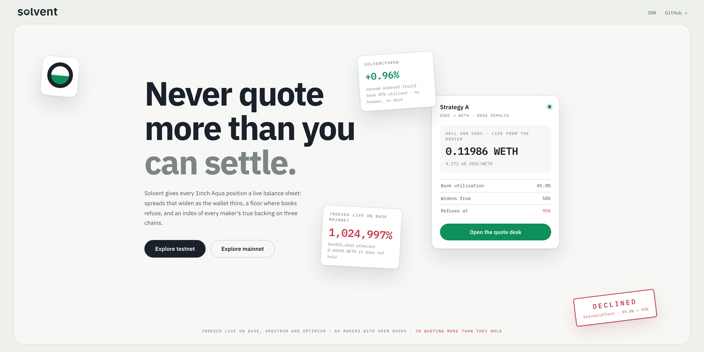
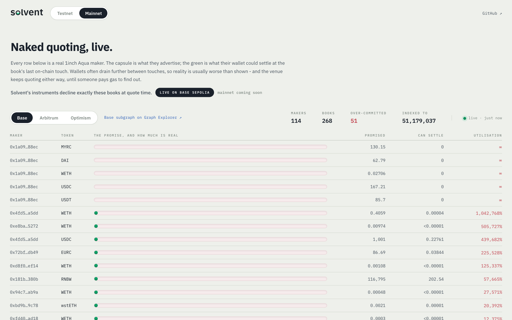
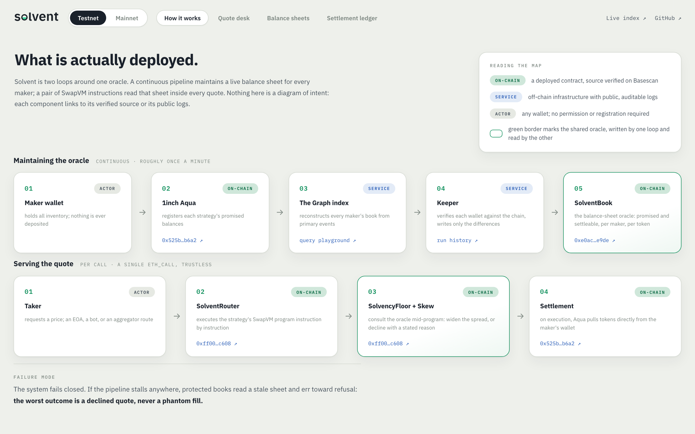
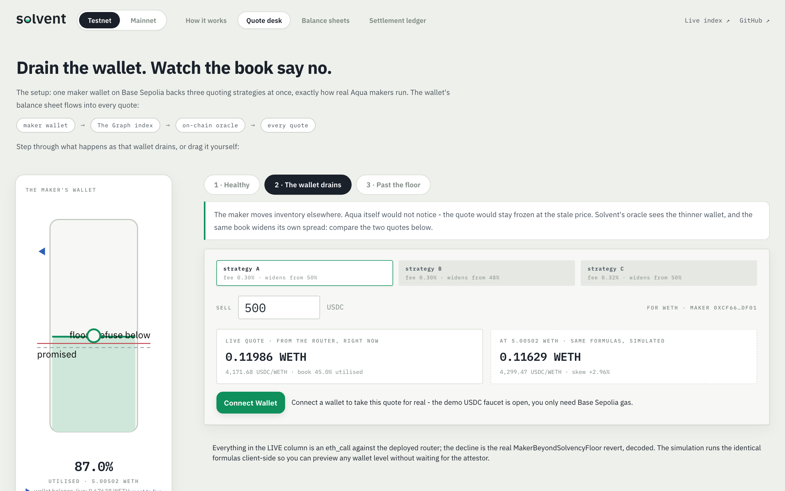
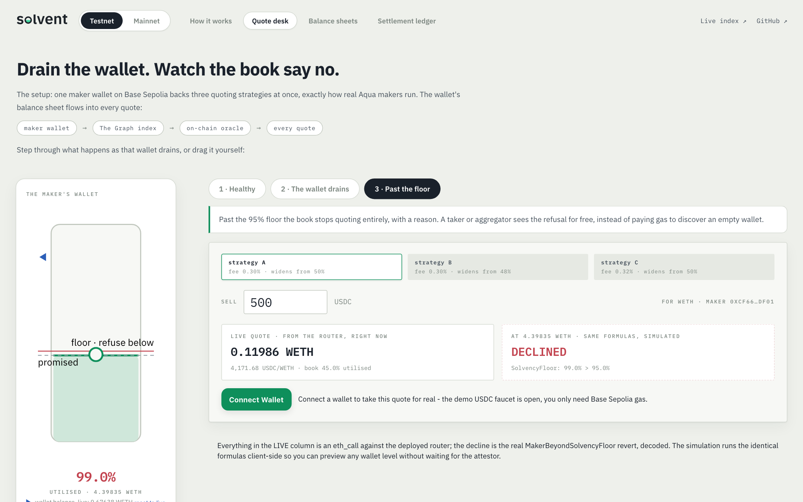

<a href="https://aman035.github.io/solvent/"></a>

<p align="center">
  <a href="https://aman035.github.io/solvent/"><b>Live demo</b></a> ·
  <a href="https://www.npmjs.com/package/@aqua-solvent/core">SDK on npm</a>
</p>

In options, selling what you do not hold is called writing naked. On
[1inch Aqua](https://github.com/1inch/aqua), every quote can be naked, and neither the
maker's own strategies nor the takers filling them have any way to know.

Solvent makes Aqua positions aware of their own balance sheet: quotes that widen as the
maker's book thins, a hard floor below which they decline instead of failing, and a
cross-chain index of every maker's true backing.

---

# The problem

Aqua is a shared liquidity layer. A market maker commits inventory to a strategy
**without depositing it**. Tokens stay in the maker's wallet, and Aqua pulls them only at
the moment a taker fills. No custody, no vault, no idle capital.

The headline benefit is that **one balance can back many strategies at once**. 1inch's
own worked example: a $100,000 balance supporting three positions that collectively quote
$300,000. Genuine capital efficiency, and the maker's losses stay capped, since nothing
is borrowed and the protocol can never take on bad debt.

But it has a structural consequence:

> **Every Aqua maker is running a fractional-reserve book, and no strategy knows about
> the others.**

SwapVM, the bytecode VM that executes Aqua strategies, has no concept of the maker's
aggregate position. Each strategy quotes as if it alone owned the whole wallet. Aqua's
`ship()` performs no aggregate check: no sum across strategies, no comparison against
balance or allowance. And the whitepaper is explicit about what happens as commitments
drift away from backing (emphasis ours):

> *"When a Maker's actual wallet balance falls below their virtual balance commitments,
> strategies become illiquid: trades cannot execute because pull operations will revert.
> Importantly, **the AMM continues quoting prices based solely on virtual balances without
> checking real balances or allowances**."*

> *"**While Aqua doesn't automatically pause illiquid positions, Makers are strongly
> recommended to manually dock strategies** that become chronically underfunded to prevent
> accumulating unfavorable price exposure."*

The venue keeps quoting. The protocol will not pause. The prescribed remedy is a human,
watching, by hand.

## Measured on mainnet

We reconstructed **every maker's balance sheet in Aqua's entire history on Base**, at
event resolution, from primary data: each strategy's tokens and amounts decoded from its
`ship()` transaction, every `Pulled` and `Pushed` applied as a delta, `Docked` books
zeroed, and each maker's actual backing (wallet balance and allowance to Aqua) read from
an archive node at 34 heights plus every book's peak moment. 442 of 443 strategies
covered. Scripts and raw output are in this repo
([`scripts/analyze-history.ts`](scripts/analyze-history.ts),
[`docs/mainnet-history.json`](docs/mainnet-history.json)).


Six weeks of live protocol, blocks 48,839,900 to 51,001,429: 443 strategies shipped by
**115 distinct makers**, with 3,848 pulls and 2,894 pushes settled through
their wallets. And against that activity:

| Finding | Value |
| --- | --- |
| Maker books that ever held a material commitment (over $100) | 88 |
| Books observed **under-backed** at least once | **78 of 88** |
| Distinct makers observed under-backed at material size | **45** |
| Material observations that were under-backed | **89%** (560 of 630) |

The worst offenders are not dust:

| Maker | Book | Peak advertised | Worst backing | Persistence |
| --- | --- | --- | --- | --- |
| [`0x5500e69d…237f`](https://basescan.org/address/0x5500e69d58d8f80b236c8a72fd52c538a5d5237f) | WETH | ~$162,754 | **9.8%** | multiple snapshots |
| [`0x7553afc9…4a55`](https://basescan.org/address/0x7553afc9cf3815ce24e33d14d1431b2918484a55) | USDC | ~$51,161 | **0.0%** | **weeks**, across 25 snapshots ~1.5 days apart |

That second book advertised roughly $50,000 of USDC while holding effectively nothing,
continuously, for weeks. Every taker who tried it got a revert. Every aggregator that
routed to it wasted its users' gas.

The same pipeline, pointed unchanged at the identical Aqua contracts on the other chains,
finds the same disease everywhere:

| Chain | Makers | Material books | Under-backed books | Worst observed |
| --- | ---: | ---: | ---: | --- |
| Base | 115 | 89 | **79** | WETH book of ~$162,754 at 9.8% backing |
| Arbitrum | 47 | 47 | **42** | WETH book of ~$142,576 at 50% backing |
| Optimism | 8 | 2 | **2** | WBTC book of ~$753 at 39% backing |
| **Total** | **170** | **138** | **123** | |

The same measurement runs live. Every row on the console's Mainnet tab is a real maker's
book right now, the capsule filled green only as far as the wallet can actually settle:



Method notes, for the skeptical: USD figures use a fixed indicative price table for major
tokens and exist only to rank materiality; backing is `min(balance, allowance)`, because
a revoked allowance makes a quote exactly as unfillable as an empty wallet; and the
mechanics are independently reproducible against the real contracts in
[`contracts/test/FractionalReserve.t.sol`](contracts/test/FractionalReserve.t.sol),
where one wallet holding 10 WETH ships three strategies advertising 30, every strategy
individually passes a backing check, and the second taker reverts through no fault of
their own.

## Who gets hurt

**Makers.** An illiquid strategy keeps quoting through price moves it cannot trade
against. The whitepaper compares the result to impermanent loss: when liquidity returns,
*"the first executable trade locks in those adverse price movements."* The recommended
defence, manual monitoring of a book that was designed to be passive, does not scale.

**Takers, especially automated ones.** An unbacked quote is indistinguishable from a
backed one until you spend gas trying to fill it. A human might notice a sketchy maker.
An agent routing purely on price will hit the same phantom quote again and again.

**Aggregators and solvers.** Unbacked quotes are often the best-priced quotes, because
stale positions quote straight through market moves. They win the route, then revert.
Fill rate is the metric aggregators live and die by.

**The venue.** None of this is bad debt, but all of it is reputation. A venue whose
quotes cannot be trusted pays for it in routing priority.

---

# The solution

## What Solvent does

Solvent makes an Aqua position aware of its own balance sheet, in bytecode. Three parts:

### 1 · `SolvencySkew`: quotes that widen as the book thins

A custom SwapVM instruction. The maker's utilisation, total commitments across every
strategy divided by what the wallet actually holds and has approved, feeds directly into
pricing:

```
utilisation 40%   →  quote at fair price
utilisation 80%   →  spread widens          (scarce inventory costs more)
utilisation 95%   →  spread widens sharply  (you are nearly a phantom)
```

This is the economically correct behaviour: the last unit of a shared balance sheet is
worth more than the first. Professional market makers have skewed quotes against
inventory since long before Avellaneda and Stoikov formalised it in 2008. It is table
stakes everywhere except on-chain, where strategies have been blind to their own books.

### 2 · `SolvencyFloor`: refuse before you fail

A hard floor. Below a maker-chosen reserve ratio, the strategy **declines at quote
time**, cheaply and visibly, instead of failing at settlement after a taker has committed
gas. This is the automatic pause the whitepaper leaves manual. And because it lives in
the program bytes, **any taker can verify the covenant before trading**. A maker who
ships a floor makes a checkable promise: my quotes are covered, and I stop quoting before
that stops being true.

### 3 · The balance-sheet index: the number nothing on-chain can compute

Both instructions need one number: the maker's aggregate commitment. **Aqua cannot
produce it.** Balances are stored per `(maker, app, strategyHash, token)` with no
enumeration, no per-maker total, and no event carrying the aggregate. The only way to
know a maker's book is to replay every `Shipped`, `Docked`, `Pulled` and `Pushed` since
genesis, which is exactly what the analysis above did, and exactly what an index is for.

One subgraph pipeline, deployed unchanged against the identical Aqua contracts on
**Base, Arbitrum and Optimism**, maintains every maker's live balance sheet. An attestor
publishes each maker's aggregate on-chain where the opcodes read it, and anyone can
recompute the same number from the same public index.

The whole system as deployed, every component linked to its verified source or public logs
on the console's How it works tab:



## What each side gets

**Makers** get the risk management the whitepaper tells them to do by hand, automated
and inside their own strategy: no adverse exposure quietly accumulating, no 3am docking,
and the capital efficiency of shared balances kept rather than abandoned.

**Takers and agents** get a pre-trade answer to the only question that matters: will
this quote actually fill? The covenant is readable in the program bytes; the balance
sheet is queryable in the index. No more gas spent discovering a phantom.

**Aggregators and solvers** get fill rate: rank quotes by reserve ratio with one query,
stop routing to the 45 makers above, and stop losing user
transactions to reverts.

**Aqua** gets what the load line gave shipping: a venue where a covered quote is worth
more than a naked one, enforced by adoption instead of protocol change.

## Competitors

No product prices an on-chain maker's solvency today, and that is not an oversight.
Before Aqua the question could not exist: every other venue takes custody, so backing
is 100% by construction. Aqua created the category by deleting custody. What exists
around it watches other layers:

| Who | What they watch | Why they miss this |
| --- | --- | --- |
| Exchange proof-of-reserves | custodial balances, attested quarterly by auditors | only works where a custodian holds the assets; Aqua makers never deposit |
| Risk platforms (Gauntlet, Chaos Labs) | protocol parameters, custodial reserve health | tune the protocol, not individual maker wallets |
| Aqua-native tooling | order books, strategy management | no view of a maker's aggregate book, because the protocol never computes it and no single contract read reveals it |
| 1inch's own remedy | the whitepaper's advice | "manually dock strategies": a human, watching, by hand |

The closest relative is exchange proof-of-reserves, and the comparison is the pitch:
same intuition, verify the backing instead of trusting the advertisement. PoR is
quarterly, custodial, and auditor-attested. Solvent is proof-of-reserves for makers
who never deposit: recomputed continuously from public events, checkable by anyone,
and enforced in the quote itself. First entrant in a category the venue just created.

## Product demand

Demand here is not projected, it is already on-chain, measured:

1. **Makers are already doing the thing.** 115 real makers within weeks of launch, 45
   of them already caught quoting more than they held. Running one wallet across many
   strategies is the whitepaper's own capital-efficiency pitch; every maker who takes
   it needs solvency management, and today their only tool is watching a wallet by hand.
2. **The protocol asks for it.** The documented remedy is manual docking by the maker.
   A venue whose own authors prescribe a human process is a venue asking for
   automation.
3. **Takers are becoming machines.** Agent-driven flow cannot eyeball counterparty
   risk mid-route. It needs risk either priced into the quote or published in an
   index it can query. Solvent does both, which is what makes declines visible at
   quote time instead of as a wasted, reverted transaction.
4. **The window is now.** The venue is multichain at identical addresses and growing.
   The fix should exist before the population scales, not after the first
   taker-visible insolvency event.

---

# Demo

## Try it live, no setup

Open **[aman035.github.io/solvent](https://aman035.github.io/solvent/)**.

1. **Mainnet**: every real Aqua maker's book on Base, Arbitrum and Optimism, indexed live.
   Most of the capsules are close to empty.
2. **Testnet → How it works**: the deployed system, each box linked to its contract or logs.
3. **Testnet → Quote desk**: a live quote from the deployed router. Step through
   *Healthy → The wallet drains → Past the floor*, or drag the wallet level yourself.
   Connect a wallet to take the quote for real; demo USDC is an open faucet.
4. **Balance sheets** and **Settlement ledger**: the numbers every quote reads, and what
   actually settled.

<table>
  <tr>
    <td width="50%"></td>
    <td width="50%"></td>
  </tr>
  <tr>
    <td align="center"><sub>The wallet drains: the same book widens its own spread</sub></td>
    <td align="center"><sub>Past the floor: the book declines, with a reason, before any gas is spent</sub></td>
  </tr>
</table>

## The end-to-end demo

One command drives the whole story on-chain in acts while the console reacts. It needs a
funded Base Sepolia wallet (`MNEMONIC` in `.env`; `pnpm fund` tops up the demo wallets).
Keep the console open beside the terminal.

```bash
pnpm demo          # pauses before each act; in act 2 you take the quote yourself
pnpm demo --fast   # no pauses; the script takes the quote as the demo taker
```

| Act | What happens on-chain | Watch in the console |
| --- | --- | --- |
| 1 · Promises | One wallet holding 10 WETH ships three strategies, each promising 1.5 WETH. No tokens move. | **Balance sheets**: the maker appears at 45% utilised |
| 2 · A real fill | A taker (you, from the Quote desk) sells 500 USDC; Aqua pulls WETH straight from the maker's wallet. | **Settlement ledger**: the fill, tagged *you* |
| 3 · The wallet drains | The maker sweeps WETH elsewhere with a plain transfer. Aqua emits no event and would keep quoting. | **Quote desk**: spreads widen on their own, 3,106.67 → 3,202.86 at 87% |
| 4 · Past the floor | The sweep continues to 99%, past the 95% floor the maker set at ship time. | **Quote desk**: every book declines with `SolvencyFloor`'s reason |
| 5 · The contrast | An unprotected maker with no floor drains; a taker trusts her quote and pays gas for a revert. | **Settlement ledger**: *returned*, on the record for good |
| 6 · Reset | Everything is restored, so the demo can run again. | |

---

# Project outline

## Structure

```
.
├── contracts/
│   ├── src/
│   │   ├── instructions/   SolvencyFloor and SolvencySkew, plus the settlement-record pair
│   │   └── opcodes/        SolventOpcodes: the banked-opcode SwapVM extension
│   └── test/            differential, invariant, and upstream 1inch regression suites
├── dashboard/           the console: how it works, quote desk, balance sheets, mainnet, ledger
├── deployments/         Base Sepolia manifest: addresses, tx hashes, verification
├── docs/                score design, cost-to-fake, mainnet analysis data, graphics
├── LICENSES/            upstream 1inch licences, preserved
├── packages/
│   └── core/            shared TS: program encoder, book and score math, bit-exact
├── scripts/             deploy, seed, the end-to-end demo, the mainnet analyzer
│   ├── attack/          cost-to-fake: measured wash-trade and sybil-review attacks
│   └── verify/          20 live checks, incl. the wei-exact mainnet parity gate
├── services/
│   └── attestor/        reads the index, writes SolventBook and the score on-chain
└── subgraph/            one schema, four deployments: Sepolia + Base, Arbitrum, Optimism
```

## Components

The live demo needs nothing from you: contracts are deployed, the indexes are public, and
the keeper runs on GitHub Actions.

### Contracts, live on Base Sepolia

Mainnet deployment is coming. All verified on Basescan; tx hashes in
[`deployments/84532.json`](deployments/84532.json).

| Contract | Address | What it does |
| --- | --- | --- |
| SolventRouter | [`0xff00…c608`](https://sepolia.basescan.org/address/0xff00bcc12a34864a3b6e411100bf839ab441c608#code) | SwapVM router carrying the Solvent instructions; quotes and settles |
| SolventBook | [`0xe0ac…e9de`](https://sepolia.basescan.org/address/0xe0acc7a4c35a1a1c37d5dbaee1bdedc2ff48e9de#code) | the balance-sheet oracle SolvencyFloor and SolvencySkew read at quote time |
| Aqua | [`0x525b…b6a2`](https://sepolia.basescan.org/address/0x525bebb9c5b4dad791402923e344b360bf6ab6a2#code) | pinned deployment of official 1inch Aqua, unmodified |
| SolventHelper | [`0x6fd4…8144`](https://sepolia.basescan.org/address/0x6fd4df8c52f952269437b22c0fa9b63f1b048144#code) | read-only order encoder for the TS clients |
| Demo WETH / USDC | [WETH](https://sepolia.basescan.org/address/0x3ac3f85cdbd1ce973cce3e67bc3cf75b79c525c7#code) · [USDC](https://sepolia.basescan.org/address/0x097b80a3a5e9a82c65ef934c3ea402502cdea1af#code) | open-mint faucet tokens, so the demo never depends on testnet liquidity |
| SolventScore | [`0x401b…8e4d`](https://sepolia.basescan.org/address/0x401b52d106906cc71c31bf96a278c3cefdf18e4d#code) | settlement record: each counterparty's delivered-value score |
| SolventRecorder | [`0xffed…1b43b`](https://sepolia.basescan.org/address/0xffeda75bd96427ab6639a4b25d9a9ac53f51b43b#code) | settlement record: makes reverted fills, which erase their own logs, indexable |
| ERC-8004 registries | [identity](https://sepolia.basescan.org/address/0xc5734c9bfc4f9d64356dea40e4fa6f8ed23f4a33#code) · [reputation](https://sepolia.basescan.org/address/0xe5e528e6a54e25df4b0e73d22c0153d6eddbef6d#code) · [adapter](https://sepolia.basescan.org/address/0x52042cf2a100c2b8cc506cbf400737b3c5147566#code) | settlement record: agent identities, and the score by agentId |

### Indexes, live on The Graph

| Subgraph | Watches | Playground |
| --- | --- | --- |
| aqua-solvent-base-sepolia | the full Sepolia stack: maker books, fills, scores | [query](https://api.studio.thegraph.com/query/42912/aqua-solvent-base-sepolia/v0.8.0/graphql) |
| aqua-solvent-base | official Aqua on Base mainnet | [query](https://api.studio.thegraph.com/query/42912/aqua-solvent-base/v0.2.0/graphql) |
| aqua-solvent-arbitrum | official Aqua on Arbitrum One | [query](https://api.studio.thegraph.com/query/42912/aqua-solvent-arbitrum/v0.2.0/graphql) |
| aqua-solvent-optimism | official Aqua on Optimism | [query](https://api.studio.thegraph.com/query/42912/aqua-solvent-optimism/v0.2.0/graphql) |

The mainnet indexes are observation-only today. When the contracts land on Base mainnet,
they become the oracle feed.

### The keeper

The attestor runs as a [GitHub Actions workflow](https://github.com/Aman035/solvent/actions/workflows/attest.yml):
about once a minute it reads every maker's book from the index, re-reads each wallet
from the chain, and writes only what changed into SolventBook. It signs with a key that
holds `ATTESTOR_ROLE` and nothing else.

## Run it locally

Prerequisites: Node 22+, pnpm 9, and [Foundry](https://getfoundry.sh) for the contracts.

```bash
git clone https://github.com/Aman035/solvent && cd solvent
pnpm install
cp .env.example .env        # public endpoints prefilled: enough for the frontend
```

**Frontend**, the same console as the live demo:

```bash
pnpm dash                   # http://localhost:5173
```

**Contracts**:

```bash
cd contracts
forge build
forge test                  # Solvent instructions, differential suites, upstream 1inch regression
```

**Attestor**, one pass of what the keeper runs every minute (needs a funded `MNEMONIC`):

```bash
pnpm attest:books           # index → live wallet reads → SolventBook
```

**Subgraph**, with the Graph CLI:

```bash
cd subgraph && npm install
npx graph codegen && npx graph build                    # Base Sepolia
npx graph build subgraph.base.yaml                      # mainnet: also .arbitrum / .optimism
npx graph deploy aqua-solvent-base-sepolia subgraph.yaml \
  --deploy-key "$GRAPH_DEPLOY_KEY" --node https://api.studio.thegraph.com/deploy/
```

**Checks**:

```bash
pnpm test                   # TS unit tests
pnpm verify                 # live checks against the whole deployment
```
