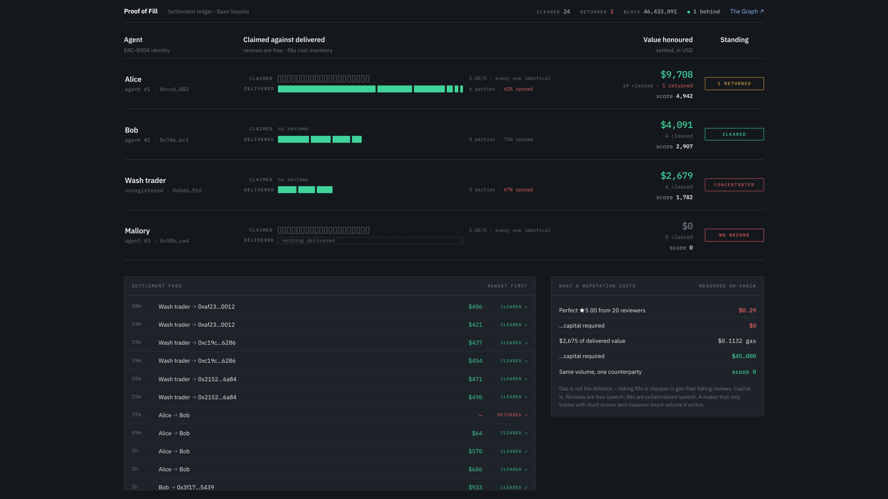

# Proof of Fill

**A reputation you had to pay for.**

Two agents. Same five stars, same twenty reviewers, indistinguishable on every axis you
can read for free. One of them has never delivered anything.



The grey ticks are reviews. They look identical because they *are* identical — anyone can
give anyone five stars, with no stake and no prior interaction. The green is value that
actually settled. It's the only thing on the page that cost anything to produce.

---

## The idea

Agents are starting to pay each other on-chain, and before paying they check the
counterparty's ERC-8004 reputation. That reputation is free to manufacture: the first
empirical study of the standard found 90.6% of reviewers on Base show coordinated Sybil
behaviour, and a fake review costs a fraction of a cent.

So don't score what an agent *says*. Score what it has *settled*.

On [1inch Aqua](https://github.com/1inch/aqua), a market maker commits liquidity without
depositing it — the tokens stay in their own wallet until a taker pulls them. That design
has an unusual consequence:

> **Every quote is a promise, and every promise is settled publicly.** Honour it and real
> tokens leave your wallet. Break it and the transaction reverts, permanently, on the
> explorer.

Neither outcome can be faked, because both cost inventory. Proof of Fill indexes both and
turns them into a score an agent — or a smart contract — can act on.

---

## What it does

**Watches settlement.** A subgraph indexes 1inch Aqua alongside the ERC-8004 registries,
maintaining the join between them: reputation is keyed by agent id, delivery is keyed by
wallet address.

**Scores delivery, not volume.**

```
reliability = honored / (honored + 3 × failed)        failures weigh 3×
diversity   = 1 − HHI                                 Herfindahl over counterparties
score       = usdHonored × reliability × diversity
```

A maker that only ever trades with itself has HHI = 1, so **diversity is 0, so its score is
exactly 0** — no matter how much volume it writes. That's an invariant, proven over 4,096
calls, not a heuristic.

**Lets makers enforce it inside the swap.** Two instructions added to SwapVM:

| | | |
| --- | --- | --- |
| `0x21` | `ReputationGate` | Refuses takers below a floor. Validation-only, so it runs under `staticcall` — a refusal is visible **at quote time**, before gas is spent on a swap. |
| `0xb3` | `ReputationPriceAdjuster` | Widens the quote instead of refusing, mirroring `FeeFlatIn`'s exact-in/exact-out arithmetic. |

Both sit in reserved free slots of their family banks, and the router uses 1inch's own
extension pattern — override `_runOpcode`, fall through to `super`. To prove nothing
upstream shifted, `contracts/test/UpstreamRegression.t.sol` imports **1inch's own Aqua test
suites unmodified** and swaps in our router. All 35 pass.

**Acts on it.** An agent reads the join live and decides:

```
▸ analysing counterparties
  Alice     ★5.00 (20)   $9,708 · 14✓ 0✗    5983    TRUST
  Mallory   ★5.00 (20)   $0     · 0✓  0✗       0    AVOID
            ⚑ REVIEW_DELIVERY_DIVERGENCE — 20 reviews averaging 5.00/5, zero delivery
  → CHOSE Alice, swapped 500 pofUSDC
```

That flag needs the ERC-8004 record joined to the Aqua record. Without the index it can't
be computed at all.

---

## What faking it costs

Both attacks were actually executed on Base Sepolia. Gas comes from real receipts,
converted to mainnet-equivalent.

| | Fake **reviews** | Fake **fills** |
| --- | --- | --- |
| Gas | $0.574 | $0.1132 |
| **Capital required** | **$0** | **$45,000** |
| Resulting score | **0** | 1780 |

**Gas is not the defence** — faking fills is *cheaper* in gas than faking reviews. Capital
is. Reviews are free speech; fills are collateralised speech.

We don't claim faking is impossible. An attacker with genuine capital and several funded
counterparties can manufacture a respectable score, testnet gas is free, and wash-traded
capital is recoverable. All of that is stated plainly in
[`docs/COST_TO_FAKE.md`](docs/COST_TO_FAKE.md) — the numbers there are measured, including
the ones that are inconvenient.

---

## Try it

```bash
pnpm install
cp .env.example .env      # an RPC, a Graph API key, a funded key
pnpm verify:all           # 15 checks against the live deployment
pnpm dash                 # the settlement ledger
```

| | |
| --- | --- |
| `pnpm bob 500` | taker agent: query the index → analyse → decide → swap |
| `pnpm alice status` | what a maker has promised vs what it actually holds |
| `pnpm alice betray` | move the committed inventory away, and break a promise |
| `pnpm attest` | derive scores from the index, write them on-chain |
| `pnpm attest:failures` | find reverted swaps and put them back on the record |
| `pnpm attack:all` | measure what a fake reputation costs |
| `pnpm demo:run` | the three scenarios end to end |

---

## Live on Base Sepolia

| | | |
| --- | --- | --- |
| **ProofOfFillSwapVMRouter** | [`0x06ac5984d1bdd04aefd3e4e33312f30ce058462e`](https://sepolia.basescan.org/address/0x06ac5984d1bdd04aefd3e4e33312f30ce058462e#code) | official router + our two instructions |
| Aqua | [`0x525bebb9c5b4dad791402923e344b360bf6ab6a2`](https://sepolia.basescan.org/address/0x525bebb9c5b4dad791402923e344b360bf6ab6a2#code) | official source, unmodified |
| ProofOfFillScore | [`0x95908bb174224f085b0f30d6236a46b27c7a6711`](https://sepolia.basescan.org/address/0x95908bb174224f085b0f30d6236a46b27c7a6711#code) | what the opcode reads |
| ProofOfFillRecorder | [`0x1b6439b8f19e32e806d5a3cac67fdb1d9a91b1c7`](https://sepolia.basescan.org/address/0x1b6439b8f19e32e806d5a3cac67fdb1d9a91b1c7#code) | makes broken promises indexable |
| ReputationRegistryAdapter | [`0x0e673c4a4534da45652ee4c7972fd9824e507eee`](https://sepolia.basescan.org/address/0x0e673c4a4534da45652ee4c7972fd9824e507eee#code) | score by ERC-8004 agent id |
| ERC-8004 Identity | [`0xc5734c9bfc4f9d64356dea40e4fa6f8ed23f4a33`](https://sepolia.basescan.org/address/0xc5734c9bfc4f9d64356dea40e4fa6f8ed23f4a33#code) | reference implementation, CC0 |
| ERC-8004 Reputation | [`0xe5e528e6a54e25df4b0e73d22c0153d6eddbef6d`](https://sepolia.basescan.org/address/0xe5e528e6a54e25df4b0e73d22c0153d6eddbef6d#code) | |
| ERC-8004 Validation | [`0x26f213094e835ea8428fc35b27a144ab0d23563e`](https://sepolia.basescan.org/address/0x26f213094e835ea8428fc35b27a144ab0d23563e#code) | |

All verified. Subgraph: [Studio](https://thegraph.com/studio/subgraph/proof-of-fill) ·
[endpoint](https://api.studio.thegraph.com/query/42912/proof-of-fill/v0.4.0)

---

## How the pieces fit

```
maker ships to Aqua ─────► tokens never move; Aqua is a ledger, not a vault
        │
taker fills ──── honoured ──► real tokens leave the maker's wallet
        │                     Swapped + Pulled
        └────── broken ─────► revert: SafeTransferFromFailed (0xf4059071)
                              …and a full revert destroys its own logs
                              so the attestor re-emits it, citing the failed tx
        ▼
subgraph: Aqua settlement ⋈ ERC-8004 reputation
        ▼
score ──► ReputationGate enforces it at quote time
```

```
contracts/     instructions, router, score, recorder, adapter — 122 tests
subgraph/      6 data sources across Aqua, our contracts, and ERC-8004
packages/core/ chain config, wallets, program encoder, score, index client
agents/        maker and taker
services/      attestor: index → score → chain, and the failure scanner
dashboard/     the settlement ledger
docs/          score design, measured attack costs, verification report
```

The score is implemented twice — once in Solidity for the opcode, once in TypeScript for
everything off-chain — and pinned together by a differential test over 1,009 cases, so the
number a dashboard shows can never drift from the number a swap enforces.

---

## What to be sceptical about

- The **attestor is a trusted updater** here. Everything it writes is re-derivable from the
  public index, and every failure it records cites a real reverted transaction anyone can
  check — but it is a trusted component, not a trustless one.
- **USD valuation uses fixed documented prices.** There is no testnet oracle.
- `ReputationGate` scores `msg.sender`, so a taker routing through an aggregator is scored
  as that contract rather than the end user.
- Mainnet Aqua restricts execution to verified resolvers. Our redeploy doesn't, and we
  don't claim that benefit.
- The score measures **financial reliability only** — whether an agent delivers what it
  quotes. Not task quality, not correctness. That narrowness is deliberate.

## Attribution

Powered by Aqua — © Degensoft Ltd. Powered by SwapVM — © Degensoft Ltd. Upstream licences
in `LICENSES/`. ERC-8004 reference implementation:
[ChaosChain/trustless-agents-erc-ri](https://github.com/ChaosChain/trustless-agents-erc-ri), CC0.
